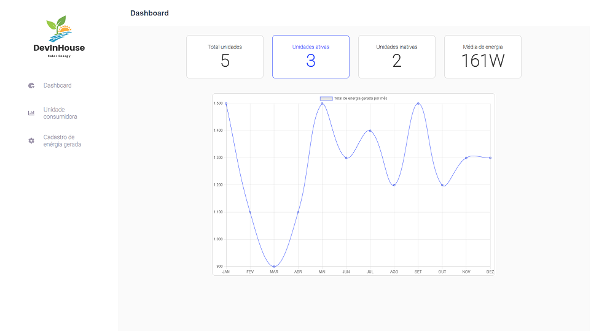

# DevInHouse Solar Energy

## Descrição

<p>Este projeto é uma aplicação web que permite o gerenciamento de unidades consumidoras e suas respectivas gerações de energia mensais. A aplicação foi desenvolvida em React, utilizando a biblioteca react-router-dom para criar rotas entre as diferentes telas. Os dados da aplicação são armazenados em um servidor json-server.</p>




## Bibliotecas Utilizadas

<p>As seguintes bibliotecas foram utilizadas neste projeto:</p>

 - React: Biblioteca para construção de interfaces de usuário.
 - React Router Dom: Biblioteca para criação de rotas entre as diferentes telas da aplicação.
 - Chart.js: Biblioteca para criação de gráficos.
 - Axios: Biblioteca para realização de requisições HTTP.
 - Json-server: Biblioteca para criação de um servidor JSON local para armazenar os dados da aplicação.

## Funcionalidades
<p>A aplicação contém as seguintes funcionalidades:<p>

 - Tela de Login: Contém um formulário de email e senha obrigatórios. Ao clicar no botão de entrar e passar pela validação, o usuário é redirecionado para a tela de Dashboard.
 - Menu Lateral: Contém as opções Dashboard, Unidade Consumidora e Cadastro de Energia Gerada. O menu foi configurado utilizando a biblioteca react-router-dom.
 - Tela de Dashboard: Contém 4 cards que exibem informações sobre as unidades consumidoras cadastradas, além de um gráfico de linha que exibe o total de energia gerado por mês.
 - Tela de Listagem de Unidades: Exibe uma tabela com as unidades consumidoras cadastradas e botões para editar e remover cada uma. Também contém um botão para adicionar uma nova unidade consumidora.
 - Tela de Cadastro de Unidades: Permite cadastrar uma nova unidade consumidora, contendo um formulário com campos obrigatórios.
 - Botão Remover Unidade: Permite remover uma unidade consumidora existente.
 - Botão Editar Unidade: Permite editar uma unidade consumidora existente.
 - Tela de Lançamento de Geração Mensal: Permite cadastrar uma nova geração mensal de energia para uma unidade consumidora existente.

## Requisitos

<p>Para executar o projeto, é necessário ter instalado o Node.js e o gerenciador de pacotes npm. Além disso, é necessário instalar as dependências do projeto, utilizando o seguinte comando:</p>


```cmd
npm install
```
Para iniciar a aplicação, basta executar o seguinte comando:

```cmd
npm start
```

<p>Para executar o json-server, siga os seguintes passos:</p>

1. Abra o terminal (no Windows, você pode usar o prompt de comando ou o PowerShell) e navegue até o diretório do projeto.

2. Execute o seguinte comando para instalar o json-server:<p>

```cmd
npm install -g json-server
```

3. Execute o json-server com o seguinte comando:

```cmd
json-server --watch server.json --port 4000
```
<p>Certifique-se de usar a porta 4000, conforme configurado na aplicação.</p>
